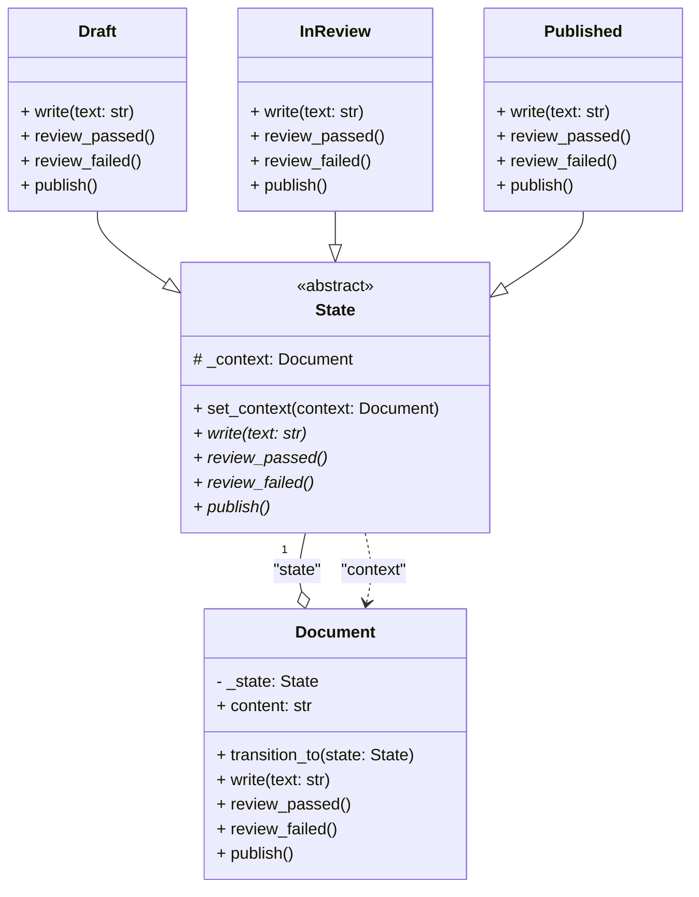

# AD1 - Padrão de Projeto: State

**Equipe:**

* Ana Paula Althoff 
* Elliston Mazela da Cruz 
* Fernando Paladini 
* Igor Rismo Coelho 
* Paulo Ricardo 

**Link do Repositório GitHub:**
* [https://github.com/UDESC-SisFEAP/udesc-padroes-de-projeto](https://github.com/UDESC-SisFEAP/udesc-padroes-de-projeto)

---

## 1. Nome do Padrão: State (Estado)

## 2. Intenção

O padrão **State** é um padrão de projeto comportamental. Sua principal intenção é **permitir que um objeto altere seu comportamento quando seu estado interno mudar**. O objeto parecerá ter mudado de classe.

Em vez de usar condicionais (como `if/else` ou `switch`) massivos dentro de uma classe para gerenciar o que ela faz com base em seu estado, o padrão encapsula cada estado em um objeto separado. O objeto principal (o "Contexto") mantém uma referência ao seu objeto de estado atual e delega a ele a execução do comportamento.

## 3. Motivação (O que o software faz)

Nosso software implementa um sistema simples de fluxo de trabalho (workflow) para um documento, como um post de blog ou um artigo científico.

**Problema:** Um objeto `Document` precisa se comportar de maneira muito diferente dependendo de seu status.

* Se estiver no estado `Draft` (Rascunho), ele deve permitir a `escrita()`, e sua ação de `publicar()` deve, na verdade, enviá-lo para `Revisão`.
* Se estiver no estado `InReview` (Em Revisão), ele **não** deve permitir a `escrita()`. Ele pode ser `aprovado()` (indo para `Publicado`) ou `reprovado()` (voltando para `Rascunho`).
* Se estiver no estado `Published` (Publicado), ele não deve permitir mais nenhuma alteração (nem `escrita()`, nem `aprovação()`).

**Solução sem o Padrão:** Teríamos uma classe `Document` com uma variável (ex: `self.status = "draft"`) e todos os métodos (`write`, `publish`, `review_passed`) conteriam grandes blocos `if/elif/else` para verificar o `self.status` antes de executar uma ação. Isso torna a classe `Document` complexa, difícil de manter e viola o Princípio da Responsabilidade Única (Single Responsibility Principle).

**Solução com o Padrão (Como o padrão ajuda):**
O padrão State resolve isso criando classes separadas para cada estado (`Draft`, `InReview`, `Published`). A classe `Document` (o Contexto) apenas armazena uma referência ao seu objeto de estado *atual* e delega as chamadas de método (como `publish()`) para ele.

Quando uma ação é executada (ex: `review_passed()` no estado `InReview`), o próprio objeto de estado é responsável por realizar a transição, instruindo o `Document` a mudar seu estado para `Published`. Isso limpa o código do `Document`, torna os estados explícitos e facilita a adição de novos estados (ex: `Archived`) sem modificar as classes de estado existentes.

## 4. Aplicabilidade

O padrão State deve ser usado nas seguintes situações:

1.  **Quando um objeto precisa mudar seu comportamento dinamicamente** dependendo de seu estado interno.
2.  **Quando o código de um objeto é complicado por muitas condicionais** (if/else, switch) que verificam o estado atual do objeto para determinar o comportamento.
3.  **Para evitar a violação de Princípios SOLID**, como o Princípio da Responsabilidade Única (cada estado cuida de seu próprio comportamento) e o Princípio Aberto/Fechado (podemos adicionar novos estados sem alterar o Contexto ou os estados existentes).

## 5. Estrutura (Diagrama de Classes)

O diagrama abaixo, em sintaxe Mermaid, ilustra a estrutura do padrão State aplicada ao nosso exemplo.



**Legenda:**
- **Document (Contexto)**: Mantém referência ao estado atual e delega operações para ele.
- **State (Interface/Classe Abstrata)**: Define a interface comum para todos os estados concretos.
- **Draft, InReview, Published (Estados Concretos)**: Implementam comportamentos específicos de cada estado.

## 6. Participantes

1. **Context (Document)**:
   - Mantém uma instância do estado concreto atual.
   - Delega as requisições de comportamento ao objeto de estado.

2. **State (Interface abstrata)**:
   - Define uma interface comum para encapsular o comportamento associado a um estado particular do Context.

3. **ConcreteState (Draft, InReview, Published)**:
   - Cada subclasse implementa o comportamento associado a um estado do Context.

## 7. Colaborações

- O Context delega requisições específicas de estado ao objeto ConcreteState atual.
- O Context pode passar a si mesmo como argumento para o State (através da propriedade `context`), permitindo que o State acesse o Context se necessário.
- Os estados concretos podem decidir quando realizar transições de estado, chamando `context.transition_to()`.

## 8. Consequências

**Vantagens:**
1. **Localiza o comportamento específico de cada estado**: Todo código relacionado a um estado particular fica em uma única classe.
2. **Facilita a adição de novos estados**: Basta criar uma nova subclasse de State.
3. **Elimina condicionais massivas**: Não há necessidade de grandes blocos `if/else` ou `switch`.
4. **Respeita o Princípio Aberto/Fechado**: Estados podem ser adicionados sem modificar classes existentes.
5. **Transições explícitas**: As mudanças de estado são claras e bem definidas.

**Desvantagens:**
1. **Aumenta o número de classes**: Cada estado requer uma classe própria.
2. **Pode ser excessivo para poucos estados simples**: Se há apenas 2-3 estados muito simples, o padrão pode adicionar complexidade desnecessária.

## 9. Como Executar

### Pré-requisitos
- Python 3.7 ou superior

### Execução
```bash
python main.py
```

### Saída Esperada
O programa demonstra o ciclo completo de um documento:
1. Criação em estado Draft
2. Escrita de conteúdo
3. Tentativa de operações inválidas
4. Envio para revisão
5. Reprovação e correção
6. Nova submissão e aprovação
7. Publicação final

## 10. Exemplos de Uso Real

O padrão State é amplamente utilizado em:

1. **Sistemas de Workflow**: Processos de aprovação, fluxos de documentos.
2. **Máquinas de Estado**: Protocolos de rede (TCP/IP), parsers, compiladores.
3. **Jogos**: Estados de personagens (andando, correndo, pulando, atacando).
4. **UI/UX**: Estados de componentes (habilitado, desabilitado, carregando).
5. **E-commerce**: Estados de pedidos (pendente, processando, enviado, entregue).

## 11. Padrões Relacionados

- **Strategy**: Semelhante ao State, mas Strategy se concentra em algoritmos intercambiáveis, enquanto State modela estados de um objeto.
- **Flyweight**: Pode ser usado para compartilhar objetos de estado quando eles não têm dados específicos da instância.

## 12. Referências

- Gamma, E., Helm, R., Johnson, R., & Vlissides, J. (1994). *Design Patterns: Elements of Reusable Object-Oriented Software*. Addison-Wesley.
- [Refactoring.Guru - State Pattern](https://refactoring.guru/design-patterns/state)
- Freeman, E., & Robson, E. (2004). *Head First Design Patterns*. O'Reilly Media.
Repositório para os trabalhos e avaliações relacionados a disciplina de Padrões de Projeto.
