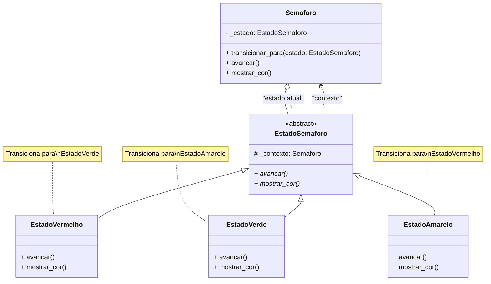
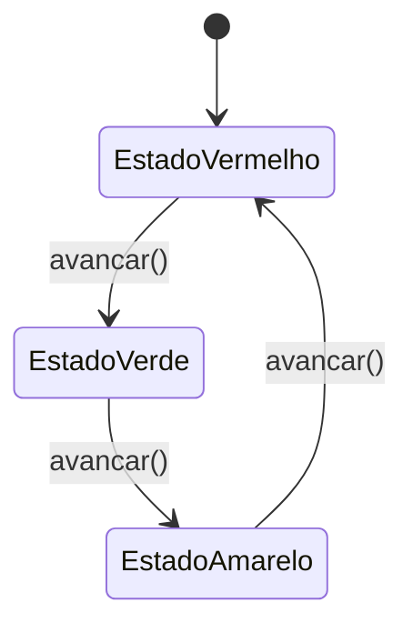

# AD1 - Padrão de Projeto: State (Exemplo Semáforo)

**Equipe:**
* Ana Paula Althoff
* Elliston Mazela da Cruz
* Fernando Paladini
* Igor Rismo Coelho
* Paulo Ricardo

**Link do Repositório GitHub:**
* [https://github.com/UDESC-SisFEAP/udesc-padroes-de-projeto-ad1](https://github.com/UDESC-SisFEAP/udesc-padroes-de-projeto-ad1)

---

## 1. Nome do Padrão: State (Estado)

## 2. Intenção

O padrão **State** é um padrão de projeto comportamental. Sua principal intenção é **permitir que um objeto altere seu comportamento quando seu estado interno mudar**. O objeto parecerá ter mudado de classe.

Em vez de usar condicionais (como `if/else` ou `switch`) massivos dentro de uma classe para gerenciar o que ela faz com base em seu estado, o padrão encapsula cada estado em um objeto separado. O objeto principal (o "Contexto") mantém uma referência ao seu objeto de estado atual e delega a ele a execução do comportamento.

## 3. Motivação (O que o software faz)

Este software implementa um exemplo clássico da ciência da computação e muito familiar no Brasil: um **Semáforo** (ou sinaleira/farol).

**Problema:** Um semáforo tem um comportamento cíclico e bem definido.

* Se o estado é **Vermelho**, ele deve mostrar a luz vermelha. Ao "avançar", ele deve trocar para **Verde**.
* Se o estado é **Verde**, ele deve mostrar a luz verde. Ao "avançar", ele deve trocar para **Amarelo**.
* Se o estado é **Amarelo**, ele deve mostrar a luz amarela. Ao "avançar", ele deve trocar para **Vermelho**.

**Solução sem o Padrão:** Teríamos uma classe `Semaforo` com uma variável (ex: `self.estado_atual = "vermelho"`). O método `avancar()` teria um `if/elif/else`:

```python
class Semaforo:
    def __init__(self):
        self.estado_atual = "vermelho"
    
    def avancar(self):
        if self.estado_atual == "vermelho":
            print("Trocando para verde...")
            self.estado_atual = "verde"
        elif self.estado_atual == "verde":
            print("Trocando para amarelo...")
            self.estado_atual = "amarelo"
        elif self.estado_atual == "amarelo":
            print("Trocando para vermelho...")
            self.estado_atual = "vermelho"
    
    def mostrar_cor(self):
        if self.estado_atual == "vermelho":
            print("LUZ: [VERMELHA] (PARE!)")
        elif self.estado_atual == "verde":
            print("LUZ: [VERDE] (SIGA!)")
        elif self.estado_atual == "amarelo":
            print("LUZ: [AMARELA] (ATENÇÃO!)")
```

**Problemas desta abordagem:**
- Código difícil de manter e estender
- Viola o Princípio Aberto/Fechado (precisa modificar a classe para adicionar novos estados)
- Viola o Princípio da Responsabilidade Única (a classe gerencia múltiplos comportamentos)
- Condicionais repetidas em múltiplos métodos

**Solução com o Padrão (Como o padrão ajuda):**

O padrão State resolve isso criando classes separadas para cada estado (`EstadoVermelho`, `EstadoVerde`, `EstadoAmarelo`). A classe `Semaforo` (o Contexto) apenas armazena uma referência ao seu objeto de estado *atual* e delega as chamadas de método (como `avancar()` e `mostrar_cor()`) para ele.

Quando uma ação é executada (ex: `avancar()` no estado `EstadoVermelho`), o próprio objeto de estado é responsável por realizar a transição, instruindo o `Semaforo` a mudar seu estado para `EstadoVerde`. Isso:

- **Elimina as condicionais**: Cada estado tem sua própria classe com comportamento específico
- **Facilita extensão**: Novos estados podem ser adicionados sem modificar código existente
- **Torna as transições explícitas**: Cada estado define claramente para qual estado ele transiciona
- **Respeita SOLID**: Cada classe tem uma única responsabilidade

## 4. Aplicabilidade

O padrão State deve ser usado nas seguintes situações:

1. **Quando um objeto precisa mudar seu comportamento dinamicamente** dependendo de seu estado interno.
2. **Quando o código de um objeto é complicado por muitas condicionais** (if/else, switch) que verificam o estado atual do objeto para determinar o comportamento.
3. **Para evitar a violação de Princípios SOLID**, como o Princípio da Responsabilidade Única (cada estado cuida de seu próprio comportamento) e o Princípio Aberto/Fechado (podemos adicionar novos estados sem alterar o Contexto ou os estados existentes).
4. **Quando as transições entre estados são bem definidas** e seguem um padrão previsível.

## 5. Estrutura (Diagrama de Classes)

O diagrama abaixo, em sintaxe Mermaid, ilustra a estrutura do padrão State aplicada ao nosso exemplo do Semáforo.



**Legenda:**
- **Semaforo (Contexto)**: Mantém referência ao estado atual e delega operações para ele.
- **EstadoSemaforo (Interface/Classe Abstrata)**: Define a interface comum para todos os estados concretos.
- **EstadoVermelho, EstadoVerde, EstadoAmarelo (Estados Concretos)**: Implementam comportamentos específicos de cada estado e definem as transições.

### Diagrama de Estados (Máquina de Estados)



## 6. Participantes

1. **Context (Semaforo)**:
   - Mantém uma instância do estado concreto atual.
   - Delega as requisições de comportamento ao objeto de estado.
   - Fornece uma interface para que os clientes interajam com o objeto.

2. **State (EstadoSemaforo)**:
   - Define uma interface comum para encapsular o comportamento associado a um estado particular do Context.
   - Declara métodos abstratos que todos os estados concretos devem implementar.

3. **ConcreteState (EstadoVermelho, EstadoVerde, EstadoAmarelo)**:
   - Cada subclasse implementa o comportamento associado a um estado do Context.
   - Decide quando e para qual estado transicionar.

## 7. Colaborações

- O **Context (Semaforo)** delega requisições específicas de estado ao objeto **ConcreteState** atual.
- O Context pode passar a si mesmo como argumento para o State (através da propriedade `contexto`), permitindo que o State acesse o Context se necessário.
- Os **estados concretos** podem decidir quando realizar transições de estado, chamando `contexto.transicionar_para()`.
- Os clientes interagem apenas com o Context, nunca diretamente com os estados.

## 8. Consequências

### Vantagens:
1. **Localiza o comportamento específico de cada estado**: Todo código relacionado a um estado particular fica em uma única classe.
2. **Facilita a adição de novos estados**: Basta criar uma nova subclasse de EstadoSemaforo.
3. **Elimina condicionais massivas**: Não há necessidade de grandes blocos `if/else` ou `switch`.
4. **Respeita o Princípio Aberto/Fechado**: Estados podem ser adicionados sem modificar classes existentes.
5. **Transições explícitas**: As mudanças de estado são claras e bem definidas.
6. **Respeita o Princípio da Responsabilidade Única**: Cada classe tem apenas uma responsabilidade.

### Desvantagens:
1. **Aumenta o número de classes**: Cada estado requer uma classe própria.
2. **Pode ser excessivo para poucos estados simples**: Se há apenas 2-3 estados muito simples, o padrão pode adicionar complexidade desnecessária.
3. **Mais arquivos para manter**: Em projetos maiores, pode resultar em muitos arquivos de classes de estado.

## 9. Estrutura do Projeto

O projeto segue as boas práticas de Python com uma estrutura modular e organizada:

```
udesc-padroes-de-projeto/
├── src/                        # Código fonte principal
│   ├── __init__.py            # Inicialização do pacote src
│   ├── semaforo.py            # Classe Semaforo (Contexto)
│   └── states/                # Pacote com todos os estados
│       ├── __init__.py        # Exporta todos os estados
│       ├── base.py            # EstadoSemaforo (classe abstrata)
│       ├── vermelho.py        # EstadoVermelho (estado concreto)
│       ├── verde.py           # EstadoVerde (estado concreto)
│       └── amarelo.py         # EstadoAmarelo (estado concreto)
├── main.py                    # Ponto de entrada da aplicação
├── requirements.txt           # Dependências do projeto
├── .gitignore                 # Arquivos ignorados pelo Git
├── README.md                  # Documentação do projeto
└── problem-definition.md      # Definição do problema acadêmico
```

### Organização dos Módulos

#### **`src/semaforo.py`**
- Contém a classe `Semaforo` (Contexto do padrão State)
- Responsável por manter o estado atual e delegar comportamentos
- Fornece métodos públicos: `avancar()`, `mostrar_cor()`, `transicionar_para()`

#### **`src/states/base.py`**
- Define a classe abstrata `EstadoSemaforo`
- Estabelece o contrato que todos os estados concretos devem seguir
- Usa `ABC` (Abstract Base Class) do Python para garantir implementação

#### **`src/states/vermelho.py`, `verde.py`, `amarelo.py`**
- Cada arquivo contém um estado concreto do semáforo
- Implementam os métodos `avancar()` e `mostrar_cor()`
- Definem as transições específicas para o próximo estado

#### **`main.py`**
- Ponto de entrada da aplicação
- Demonstra o uso do padrão State
- Código cliente limpo e separado da lógica de negócio

### Benefícios desta Estrutura

✅ **Separação de Responsabilidades**: Cada módulo tem uma função clara
✅ **Facilita Testes**: Cada classe pode ser testada independentemente
✅ **Escalabilidade**: Novos estados podem ser adicionados facilmente
✅ **Manutenibilidade**: Código organizado é mais fácil de manter
✅ **Reutilização**: Classes podem ser importadas em outros projetos
✅ **Type Hints**: Uso de anotações de tipo para melhor IDE support
✅ **Documentação**: Docstrings em todas as classes e métodos

## 10. Como Executar

### Pré-requisitos
- Python 3.7 ou superior

### Execução
```bash
python main.py
```

### Saída Esperada
O programa demonstra o ciclo completo de um semáforo por 6 iterações:

```
SISTEMA: Trocando para o estado EstadoVermelho
LUZ: [VERMELHA] (PARE!)
Sinal VERMELHO... Aguardando... Trocando para VERDE.

SISTEMA: Trocando para o estado EstadoVerde
LUZ: [VERDE] (SIGA!)
Sinal VERDE... Siga em frente... Trocando para AMARELO.

🚦 SISTEMA: Trocando para o estado EstadoAmarelo

--- Transição 3/6 ---
🟡 LUZ: [AMARELA] (ATENÇÃO!)
Sinal AMARELO... Atenção... Trocando para VERMELHO.

...

--- Estado Final ---
🔴 LUZ: [VERMELHA] (PARE!)

Estado atual do semáforo: EstadoVermelho

============================================================
DEMONSTRAÇÃO CONCLUÍDA COM SUCESSO!
============================================================
```

## 11. Exemplos de Uso Real

O padrão State é amplamente utilizado em:

1. **Semáforos e Sistemas de Controle de Tráfego**: Exatamente como nosso exemplo!
2. **Máquinas de Estado em Protocolos de Rede**: TCP/IP (estados: LISTEN, SYN_SENT, ESTABLISHED, etc.)
3. **Compiladores e Parsers**: Estados de análise léxica e sintática
4. **Jogos**: Estados de personagens (parado, andando, correndo, pulando, atacando, defendendo)
5. **Sistemas de Workflow**: Processos de aprovação, fluxos de documentos (rascunho, em revisão, publicado)
6. **E-commerce**: Estados de pedidos (pendente, processando, enviado, entregue, cancelado)
7. **UI/UX**: Estados de componentes (habilitado, desabilitado, carregando, erro)
8. **Máquinas de Venda Automática**: Estados (aguardando moeda, selecionando produto, dispensando produto)

## 12. Padrões Relacionados

- **Strategy**: Semelhante ao State estruturalmente, mas com intenções diferentes. Strategy se concentra em algoritmos intercambiáveis, enquanto State modela estados internos de um objeto.
- **Flyweight**: Pode ser usado para compartilhar objetos de estado quando eles não têm dados específicos da instância (estados sem estado interno - stateless states).
- **Singleton**: Estados frequentemente são implementados como Singletons quando não possuem dados de instância.

## 13. Referências

- Gamma, E., Helm, R., Johnson, R., & Vlissides, J. (1994). *Design Patterns: Elements of Reusable Object-Oriented Software*. Addison-Wesley.
- [Refactoring.Guru - State Pattern](https://refactoring.guru/design-patterns/state)
- Freeman, E., & Robson, E. (2004). *Head First Design Patterns*. O'Reilly Media.
- Martin, R. C. (2017). *Clean Architecture: A Craftsman's Guide to Software Structure and Design*. Prentice Hall.
